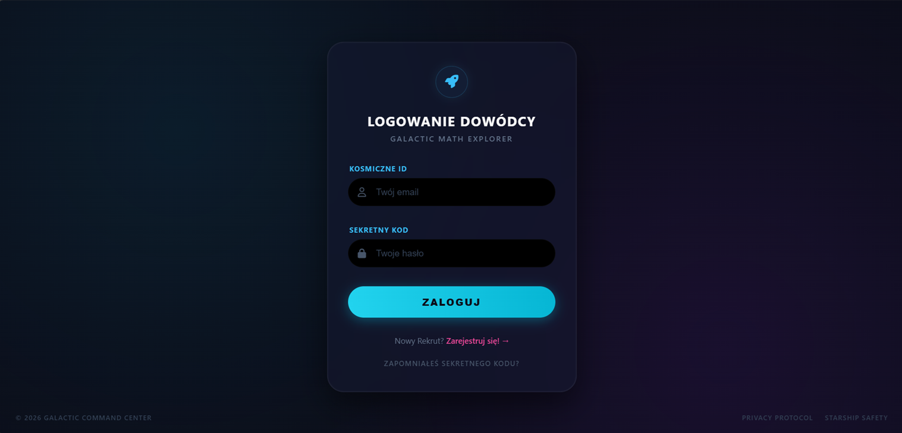
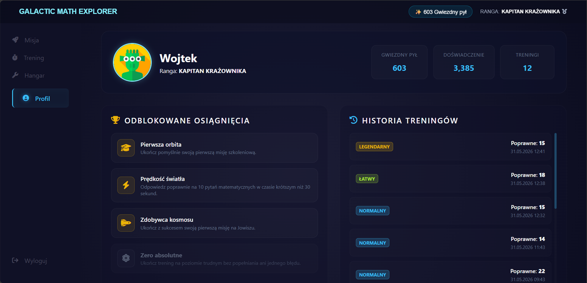
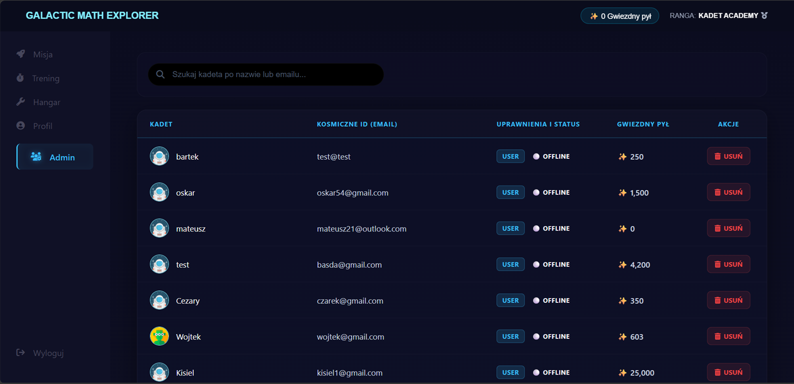
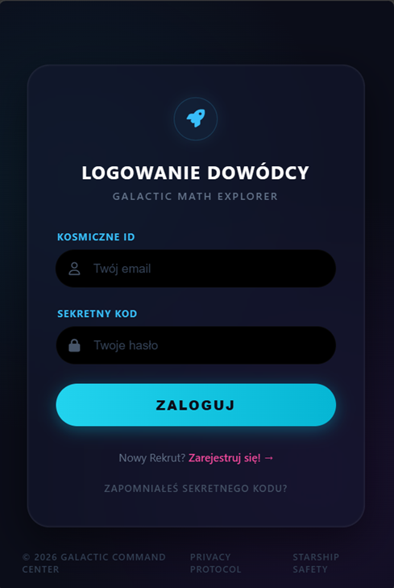
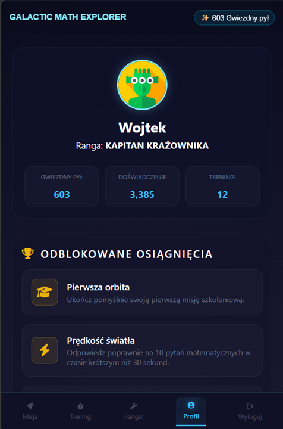
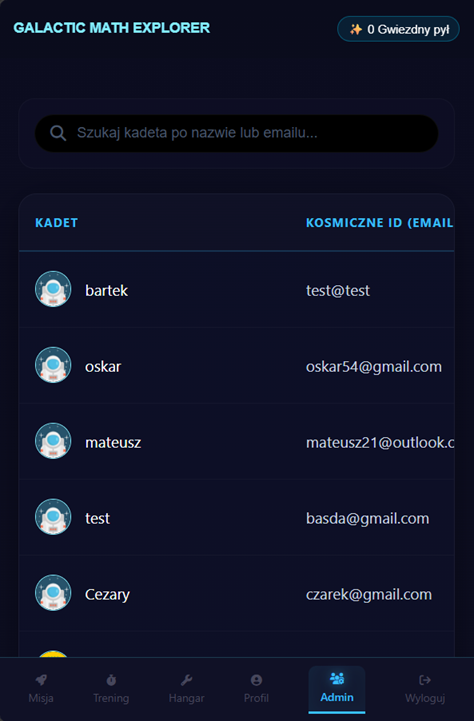

# Galactic Math Explorer – Dokumentacja Techniczna Systemu


---

## 1. Opis Projektu

**Galactic Math Explorer** to internetowa aplikacja edukacyjno-grywalizacyjna wspomagająca procesy dydaktyczne w obszarze matematyki. System integruje moduły obliczeniowe z mechanizmami gamifikacji, umożliwiając użytkownikom rozwijanie profili poprzez rozwiązywanie zadań problemowych, generowanie sesji treningowych oraz interakcję z systemem nagród w module personalizacji (hangar).

Projekt składa się z dwóch integralnych obszarów funkcjonalnych: aplikacji klienckiej (strefa użytkownika) oraz panelu administracyjnego (back-office) służącego do zarządzania strukturą użytkowników i bezpieczeństwem systemu.

### 1.1. Kluczowe Komponenty Systemu

* **Moduł Autentykacji i Kontroli Dostępu (Security):** * Rejestracja użytkowników z implementacją mechanizmów walidacji danych wejściowych po stronie serwera (wyrażenia regularne badające złożoność haseł).
  * Bezpieczne logowanie z wykorzystaniem kryptograficznego haszowania haseł algorytmem `PASSWORD_BCRYPT`.
  * Zarządzanie stanem sesji użytkownika i autoryzacja żądań HTTP.

* **Moduł Kliencki (User Area):**
  * **Profil (Dashboard):** Agregacja danych statystycznych użytkownika, prezentacja poziomu progresu oraz stanu punktowego (Star Dust).
  * **Misje i Treningi:** Silniki generujące zadania matematyczne o zmiennym stopniu trudności wraz z weryfikacją poprawności odpowiedzi w czasie rzeczywistym.
  * **Personalizacja (Hangar):** Moduł transakcyjny umożliwiający wymianę zgromadzonej waluty wewnątrzaplikacyjnej na unikalne identyfikatory graficzne (awatary) powiązane relacyjnie w bazie danych.

* **Moduł Administracyjny (Admin Back-Office):**
  * Zarządzanie rekordami użytkowników zaimplementowane z uwzględnieniem paginacji i limitów wydajnościowych bazy danych (maksymalnie 100 rekordów w pojedynczym zestawie danych).
  * System asynchronicznego filtrowania i wyszukiwania rekordów w locie (Vanilla JS Fetch API) bez konieczności przeładowywania drzewa DOM.
  * System zarządzania uprawnieniami i blokadami dostępu (Soft-Ban / Restoring), realizowany za pomocą asynchronicznych żądań POST.

* **Globalny Podsystem Zarządzania Statusem Użytkownika:**
  * Automatyczna kontrola stanów aktywności konta w cyklu życia aplikacji. System dynamicznie zarządza trzema jawnymi statusami: `online` (ustawiany proceduralnie po poprawnej autentykacji), `offline` (inicjowany domyślnie podczas rejestracji oraz wywoływany w akcji destrukcji sesji/wylogowania) oraz `banned` (nakładany przez administratora, skutkujący natychmiastową blokadą dostępu na poziomie warstwy bezpieczeństwa kontrolera).

---

## 2. Stos Technologiczny (Tech Stack)

Aplikacja została zaimplementowana w architekturze **Vanilla** – zgodnie z założeniami projektowymi, system nie wykorzystuje zewnętrznych frameworków backendowych (np. Symfony, Laravel), frontendowych (np. React, Vue) ani gotowych bibliotek i szablonów arkuszy stylów (np. Bootstrap, Tailwind CSS).

* **Backend:** PHP 8.x – paradygmat w pełni obiektowy (OOP), implementacja architektury wzorca MVC (Model-View-Controller) oraz ścisłe stosowanie zasad SOLID (w szczególności zasady pojedynczej odpowiedzialności – SRP). Separacja logiki biznesowej od dostępu do danych zrealizowana za pomocą dedykowanych klas repozytoriów (`Repositories`).
* **Baza Danych:** PostgreSQL – relacyjny system zarządzania bazą danych (RDBMS). Struktura bazy danych spełnia założenia 3 postaci normalnej (3NF), eliminując redundancję oraz anomalie modyfikacji i usunięć. Wykorzystuje zaawansowane mechanizmy więzów integralności, widoki (złączenia wielotabelowe), funkcje proceduralne, wyzwalacze (triggers) oraz transakcje na odpowiednim poziomie izolacji danych.
* **Frontend:**
  * Semantyczny kod **HTML5** definiujący strukturę dokumentów.
  * Autorski **CSS3** z wykorzystaniem modułów Flexbox i Grid Layout oraz reguł *Media Queries*, zapewniający pełną responsywność interfejsu (Responsive Web Design – RWD).
  * **Vanilla JavaScript** (ES6+) z implementacją standardu **Fetch API** do asynchronicznej wymiany danych w formacie JSON z API backendowym.
* **Konteneryzacja i Środowisko:** **Docker** oraz **Docker Compose** – pełna konteneryzacja środowiska uruchomieniowego (serwer WWW, interpreter PHP, baza danych PostgreSQL), zapewniająca deterministyczne i powtarzalne środowisko wykonawcze na dowolnej stacji roboczej.
* **Kontrola Wersji:** **GIT** – systematyczna, atomowa wersjonizacja kodu źródłowego udokumentowana historią commitów w repozytorium publicznym.


## 3. Architektura i Zasady Kodowania

### 3.1. Implementacja Wzorca MVC (Model-View-Controller)
Aplikacja została zaprojektowana w oparciu o autorski system routingu oraz architekturę MVC, zapewniając bezkompromisową separację warstwy prezentacji od logiki biznesowej i dostępu do danych. 

* **Front Controller (`index.php` & `Routing.php`):** Centralny punkt wejściowy aplikacji przechwytuje wszystkie żądania HTTP. Klasa `Routing` analizuje adres URL za pomocą wyrażeń regularnych (Regex) i mapuje je dynamicznie na odpowiednie kontrolery i metody akcji. Dodatkowo router implementuje **Wzorzec Singleton** poprzez prywatną tablicę `$instances`, co gwarantuje ponowne użycie tej samej instancji kontrolera w cyklu życia żądania i optymalizuje zużycie pamięci operacyjnej.
* **Warstwa Kontrolerów (`src/controllers/`):** Klasy dziedziczące po klasie bazowej `AppController` odpowiadają za sterowanie przepływem aplikacji i autoryzację żądań. Metoda `render()` automatycznie agreguje dane sesyjne, dociąga kluczowe statystyki z poziomu `UsersRepository` i wstrzykuje je jako zmienne widoku (metoda `extract()`), wykorzystując buforowanie wyjścia (`ob_start()`, `ob_get_clean()`).
* **Warstwa Modelu / Dostępu do Bazy Danych (`src/repositories/`):** Repozytoria (dziedziczące po klasie `Repository`) stanowią izolację operacji na bazie danych PostgreSQL (Data Access Layer). Kontrolery nigdy nie komunikują się bezpośrednio z bazą danych – zapytania SQL są w pełni hermetyzowane w metodach repozytoriów z użyciem parametryzowanych obiektów PDO (`prepare()`, `bindParam()`), co całkowicie eliminuje podatności typu SQL Injection.
* **Warstwa Widoku (`public/views/`):** Czyste szablony dokumentów z dynamicznymi wstawkami PHP, renderowane w izolowanym środowisku i całkowicie wolne od logiki biznesowej.

### 3.2. Zgodność z Filarami Obiektowości (OOP)
Projekt został zrealizowany w sposób całkowicie purystyczny względem programowania obiektowego, co wyklucza podejście strukturalne:
* **Abstrakcja i Hermetyzacja:** Wszelkie interakcje z bazą danych oraz mechanizmy sesyjne są ukryte za publicznymi interfejsami metod. Pola klas oraz metody pomocnicze posiadają restrykcyjne modyfikatory dostępu (`private`, `protected`).
* **Dziedziczenie i Polimorfizm:** Ponowne użycie kodu realizowane jest poprzez hierarchię klas. Wszystkie kontrolery rozszerzają klasę `AppController`, zyskując unifikację walidacji metod HTTP oraz renderowania. Repozytoria współdzielą obiekt połączenia z bazą danych dzięki dziedziczeniu po klasie bazowej `Repository`.

### 3.3. Realizacja Zasad SOLID w Kodzie Źródłowym
* **Single Responsibility Principle (Zasada Pojedynczej Odpowiedzialności):** Każda klasa odpowiada za ściśle zdefiniowany obszar. Przykładowo, `SecurityController` procesuje wyłącznie autentykację i rejestrację, podczas gdy zadania bazodanowe dla tych procesów deleguje do dedykowanej klasy `UsersRepository`.
* **Open/Closed Principle (Zasada Otwarty/Zamknięty):** System routingu (`Routing.php`) oraz klasa bazowa kontrolera zostały zaprojektowane tak, aby dodawanie nowych funkcjonalności (np. kolejnych misji matematycznych) odbywało się poprzez rozszerzanie systemu o nowe klasy kontrolerów i repozytoriów, bez konieczności modyfikacji bazowych mechanizmów renderujących.
* **Liskov Substitution Principle (Zasada Podstawienia Liskov):** Wszystkie kontrolery (np. `AdminController`, `MissionController`) mogą bez przeszkód zastępować instancję bazową `AppController` w mechanizmie wywołań refleksyjnych routera, nie naruszając spójności wykonania programu.
* **Interface Segregation Principle (Zasada Segregacji Interfejsów):** Repozytoria zostały rozbite na mniejsze, wyspecjalizowane jednostki (`HangarRepository`, `TrainingRepository`, `MissionRepository`), dzięki czemu dany moduł korzysta tylko z tych metod dostępu do danych, których rzeczywiście wymaga logika biznesowa.
* **Dependency Inversion Principle (Zasada Odwrócenia Zależności):** Kontrolery wysokiego poziomu nie tworzą bezpośrednich połączeń niskopoziomowych z bazą danych PostgreSQL. Zamiast tego polegają na warstwie abstrakcji dostarczanej przez komponenty repozytoryjne, co uniezależnia architekturę kodu od fizycznej implementacji bazy danych.


## 4. Instrukcja Uruchomienia (Deployment)

Środowisko uruchomieniowe aplikacji zostało w pełni skonteneryzowane przy użyciu narzędzia **Docker Compose**. Gwarantuje to pełną powtarzalność konfiguracji serwera WWW, interpretera PHP oraz relacyjnej bazy danych na dowolnej stacji roboczej bez konieczności lokalnej instalacji oprogramowania układowego.

### 4.1. Architektura Środowiska Docker

Architektura systemu opiera się na wydzielonej i odizolowanej sieci wewnętrznej (`pg-network`), w ramach której komunikują się cztery dedykowane mikroserwisy:

1. **`server` (Nginx 1.17.8)**
   Główny serwer HTTP, nasłuchujący na porcie gospodarza `8080` i przekierowujący ruch do kontenera aplikacji PHP za pomocą protokołu FastCGI.

2. **`php` (PHP 8.3.18 FPM)**
   Środowisko wykonawcze interpretera PHP (wersja Alpine) skompilowane z rozszerzeniami wymaganymi do obsługi systemu:

   * `pdo_pgsql`
   * `pgsql`
   * `gd`
   * `bcmath`
   * `zip`
   * `opcache`

3. **`db` (PostgreSQL)**
   Relacyjna baza danych mapowana na port lokalny `5433` w celu uniknięcia konfliktów z ewentualnymi lokalnymi instancjami systemów RDBMS. Kontener implementuje mechanizm automatycznej inicjalizacji struktur poprzez wolumen dowiązany do katalogu `/docker-entrypoint-initdb.d`.

4. **`pgadmin-wdpai` (pgAdmin4)**
   Webowy interfejs administracyjny do zarządzania bazą danych, dostępny na porcie lokalnym `5050`.

---

### 4.2. Zmienne Środowiskowe (`.env.example`)

Zmienne konfiguracyjne środowiska bazodanowego zostały wbudowane w deskryptor obrazu bazy danych. W przypadku wdrażania produkcyjnego lub migracji na zewnętrzny serwer należy utworzyć plik `.env` w oparciu o poniższy schemat parametrów strukturalnych:

```env
# Konfiguracja Połączenia PostgreSQL
POSTGRES_USER=docker
POSTGRES_PASSWORD=docker
POSTGRES_DB=db
POSTGRES_HOST=db
POSTGRES_PORT=5432

# Konfiguracja Narzędzia pgAdmin
PGADMIN_DEFAULT_EMAIL=admin@example.com
PGADMIN_DEFAULT_PASSWORD=admin
```

---

### 4.3. Procedura Uruchomienia Krok po Kroku

Przed rozpoczęciem procedury należy upewnić się, że w systemie operacyjnym zainstalowany oraz uruchomiony jest Docker Desktop wraz z wtyczką Docker Compose.

#### Krok 1: Sklonowanie repozytorium kodu źródłowego

```bash
git clone <URL_TWOJEGO_PUBLICZNEGO_REPOZYTORIUM>
cd galactic-math-explorer
```

#### Krok 2: Budowanie obrazów oraz inicjalizacja kontenerów

Uruchom procedurę budowania kontenerów w tle (tryb detached) za pomocą polecenia:

```bash
docker-compose up --build -d
```

Parametr `--build` wymusi ponowne skompilowanie warstw zależności PHP oraz Nginx na podstawie dedykowanych plików Dockerfile, natomiast parametr `-d` zwolni konsolę systemową.

#### Krok 3: Weryfikacja statusu operacyjnego maszyn

Aby upewnić się, że wszystkie serwisy działają poprawnie, należy zweryfikować ich status:

```bash
docker-compose ps
```

Wszystkie cztery kontenery (`server`, `php`, `db`, `pgadmin-wdpai`) powinny posiadać status **Up**.

#### Krok 4: Dostęp do interfejsów systemowych

Po pomyślnym zakończeniu procedury konteneryzacji poszczególne moduły systemu będą dostępne pod następującymi adresami:

#### Aplikacja główna

```text
http://localhost:8080
```

#### Panel pgAdmin4

```text
http://localhost:5050
```

**Dane logowania:**

```text
Email: admin@example.com
Hasło: admin
```

**Parametry połączenia z bazą danych wewnątrz pgAdmin:**

```text
Host: db
Port: 5432
Username: docker
Password: docker
Database: db
```

---

### 4.4. Wyłączenie środowiska aplikacji

W celu zatrzymania działania mikroserwisów bez utraty danych zapisanych w bazie danych należy wykonać polecenie:

```bash
docker-compose down
```


## 5. Baza Danych


TODO


## 6. Interfejs i Wygląd (Design)

Warstwa prezentacji aplikacji **Galactic Math Explorer** została zaprojektowana od zera w estetyce *Dark Mode UI*, nawiązującej bezpośrednio do motywów science-fiction. Projekt graficzny stawia na wysoki kontrast, czytelną typografię oraz intuicyjne rozmieszczenie elementów kontrolnych, co optymalizuje doświadczenia użytkownika (User Experience - UX) zarówno podczas procesów dydaktycznych, jak i operacji administracyjnych.

### 6.1. Architektura Stylizacji i Układu (Natywny CSS3)

Zgodnie z wymaganiami technicznymi, warstwa wizualna została zaimplementowana bez użycia zewnętrznych bibliotek klas komponentowych (takich jak Bootstrap czy Tailwind CSS). Układ elementów (Layout) opiera się na nowoczesnych, natywnych modułach pozycjonowania:
* **CSS Grid Layout:** Wykorzystany do zdefiniowania globalnej struktury aplikacji (`.layout`), dzielącej przestrzeń ekranową na stały panel nawigacyjny (Sidebar), nagłówek (Header) oraz dynamiczną przestrzeń roboczą (`<main>`).
* **CSS Flexbox:** Zastosowany wewnątrz komponentów (np. komórki tabeli panelu admina, karty misji, układy formularzy) w celu precyzyjnego pozycjonowania liniowego, centrowania zawartości oraz zarządzania odstępami.
* **Zmienne CSS (CSS Variables):** Paleta kolorystyczna, zaokrąglenia krawędzi (border-radius) oraz przejścia tonalne zostały sparametryzowane w bloku `:root`, co zapewnia spójność wizualną we wszystkich podstronach oraz łatwość modyfikacji motywu.

### 6.2. Responsywność Systemu (Responsive Web Design - RWD)

Pełna kompatybilność z urządzeniami mobilnymi oraz stacjonarnymi o różnych rozdzielczościach ekranu została osiągnięta za pomocą technologii **Media Queries**. System płynnie adaptuje układ interfejsu na podstawie trzech głównych punktów przełamania (Breakpoints):
1. **Powyżej 1024px (Ekrany Desktopowe):** Pełny układ wielokolumnowy. Panel boczny (`nav`) jest stale widoczny po lewej stronie, zapewniając natychmiastowy dostęp do wszystkich modułów.
2. **Od 768px do 1024px (Tablety):** Kompaktowanie przestrzeni roboczej. Szerokość marginesów oraz dopełnień (padding) ulega zmniejszeniu, a elementy siatki Grid dopasowują swoją szerokość proporcjonalnie do szerokości okna przeglądarki.
3. **Poniżej 768px (Smartfony):** Głęboka restrukturyzacja układu (Reflow). Dwukolumnowa struktura bazy (`.layout`) transformuje się w układ jednokolumnowy. Panel boczny nawigacji zostaje ukryty lub przeniesiony na dolną krawędź ekranu w formie paska ikon (Mobile Tab Bar), zwiększając przestrzeń roboczą dla komponentów gry. Tabele (w tym tabela użytkowników w panelu administracyjnym) zyskują niezależną, horyzontalną oś przewijania (`overflow-x: auto`), co zapobiega zjawisku uszkodzenia layoutu (brak efektu poziomego paska przewijania całej strony).

---

### 6.3. Dokumentacja Graficzna (Zrzuty Ekranu)

*W celu pełnej weryfikacji implementacji frontendu, poniżej przedstawiono zrzuty ekranu aplikacji w wersji dla urządzeń stacjonarnych oraz urządzeń mobilnych.*


#### 6.3.1. Wersja Webowa (Desktop View)

##### Ekran Logowania i Autentykacji
Prezentuje centralnie pozycjonowany formularz z pełną obsługą komunikatów błędów generowanych przez serwer.


##### Panel Dowodzenia Kadeta (Profil)
Widok profilu użytkownika integrujący statystyki, stan waluty (Star Dust) oraz wyrenderowany komponent awatara pobranego relacyjnie z bazy danych.


##### Panel Administracyjny Back-Office
Interfejs administracyjny prezentujący pełną tabelę użytkowników wraz z dynamicznymi pigułkami statusów sieciowych (`online`, `offline`, `banned`) oraz przyciskami akcji.


#### 6.3.2. Wersja Mobilna (Mobile View)

##### Ekran Logowania (Skalowanie Mobilne)
Układ formularza dostosowany do ekranów dotykowych, zachowujący pełną czytelność pól wprowadzania danych.



##### Panel Dowodzenia Kadeta (Widok Smartfon)
Zreorganizowany układ elementów, gdzie sekcje statystyk układają się pionowo, zapewniając wygodne przewijanie jednoręczne.



##### Panel Administracyjny (Widok Smartfon)
Prezentacja elastyczności tabeli administracyjnej z zachowaniem czytelności odznak statusowych oraz ułatwioną interakcją z przyciskami banowania/przywracania.




## 7. Bezpieczeństwo Aplikacji (Cybersecurity Blueprint)

Projekt **Galactic Math Explorer** został zaprojektowany z uwzględnieniem paradygmatu *Security by Design*. W warstwie kontrolerów (`SecurityController`), routing-u oraz bazy danych wdrożono szereg mechanizmów obronnych, które eliminują najczęstsze podatności zdefiniowane w klasyfikacji **OWASP Top 10**.

### 7.1. Ochrona przed Cross-Site Request Forgery (CSRF)
W celu uniemożliwienia przeprowadzenia ataków polegających na wymuszeniu wykonania nieautoryzowanych żądań w imieniu zalogowanego kadeta, formularze uwierzytelniania (`login`, `register`) zostały wyposażone w kryptograficzne tokeny synchronizacyjne (*Synchronizer Token Pattern*):
* **Generowanie:** Podczas każdego żądania typu `GET` serwer generuje losowy, 32-bajtowy ciąg znaków przy użyciu bezpiecznej kryptograficznie funkcji `bin2hex(random_bytes(32))` i osadza go w sesji użytkownika (`$_SESSION['csrf_token']`).
* **Wstrzykiwanie:** Token jest przekazywany do widoku HTML i serwowany w ukrytym polu formularza (`<input type="hidden" name="csrf_token">`).
* **Weryfikacja:** Przy żądaniach `POST` kontroler dokonuje twardego porównania przesłanego tokenu z wartością sesyjną. W przypadku niezgodności lub braku tokenu, sesja jest natychmiastowo czyszczona (`unset`), a transakcja przerywana.

### 7.2. Architektoniczny Podział Czasowników HTTP (Strict MVC Routing)
W celu zabezpieczenia punktów końcowych (endpoints) przed nieautoryzowanym wstrzykiwaniem danych, wdrożono rygorystyczną kontrolę metod protokołu HTTP:
* Żądania typu **GET** służą wyłącznie do prezentacji warstwy wizualnej (renderowanie czystego formularza) i całkowicie omijają logikę biznesową.
* Przetwarzanie danych, walidacja oraz interakcja z warstwą danych (PostgreSQL) odbywają się **wyłącznie** wewnątrz izolowanych bloków warunkowych `if ($this->isPost())`. Próby przesłania parametrów w adresie URL (Query String) na endpointach operacyjnych są całkowicie ignorowane.

### 7.3. Ograniczenie Długości Danych Wejściowych i Ochrona przed DoS
Aplikacja posiada wielowarstwowe ograniczenia długości ciągów tekstowych wprowadzanych przez użytkownika, co zapobiega atakom typu *Buffer Overflow* oraz odmowie usługi (*Denial of Service*):
* **Filtrowanie Backendowe:** W kontrolerze zdefiniowano sztywne limity: adres e-mail (max 255 znaków), nazwa użytkownika (max 50 znaków), hasło (max 72 znaki).
* **Ochrona Procesora (Bcrypt Mitigation):** Ograniczenie hasła do 72 znaków jest kluczowym zabiegiem bezpieczeństwa – algorytm `PASSWORD_BCRYPT` domyślnie ignoruje znaki powyżej tej długości, a próba haszowania gigantycznych ciągów tekstowych (np. kilkumegabajtowych) mogłaby intencjonalnie doprowadzić do stuprocentowego przeciążenia procesora serwera (CPU exhaustion).
* **Spójność z Bazą Danych:** Limity te są rygorystycznie odzwierciedlone w strukturze bazy danych PostgreSQL poprzez typy danych `VARCHAR(255)` oraz `VARCHAR(50)`, zamiast nielimitowanego typu `TEXT`.

### 7.4. Bezpieczna Polityka Zarządzania Sesją (Session Management)
W celu eliminacji podatności związanych z przechwytywaniem oraz fiksacją sesji (*Session Fixation*), zaimplementowano następujące procedury:
* **Regeneracja ID:** Natychmiast po pomyślnym uwierzytelnieniu i zweryfikowaniu tożsamości kadeta, wywoływana jest funkcja `session_regenerate_id(true)`. Powoduje to zniszczenie starego identyfikatora sesji i wygenerowanie całkowicie nowego, uniemożliwiając napastnikowi przejęcie uprawnień za pomocą wcześniej podetkniętego identyfikatora.
* **Czyszczenie Po-autentykacyjne:** Po zalogowaniu token CSRF z fazy logowania jest niszczony, aby wymusić wygenerowanie nowej puli kluczy dla sesji uwierzytelnionej.
* **Rygorystyczny Destruktor (Logout):** Podczas wylogowywania aplikacja jawnie nadpisuje tablicę sesji pustą strukturą (`$_SESSION = []`), unieważnia i kasuje ciasteczko sesyjne w przeglądarce klienta poprzez ustawienie wstecznego czasu wygaśnięcia (Unix timestamp w przeszłości) oraz ostatecznie niszczy sesję na serwerze za pomocą `session_destroy()`.

### 7.5. Silna Kryptografia i Walidacja Złożoności Autoryzacyjnej
* **Haszowanie Haseł:** Hasła użytkowników nigdy nie są przechowywane w bazie danych w postaci jawnej. Do ich zabezpieczenia wykorzystano standard przemysłowy `password_hash()` z algorytmem `PASSWORD_BCRYPT`, zapewniający automatyczną implementację losowej soli (salt) dla każdego rekordu. Weryfikacja odbywa się poprzez bezpieczne czasowo porównanie `password_verify()`.
* **Wymuszenie Silnych Haseł (Policy Enforcement):** Proces rejestracji odrzuca słabe hasła za pomocą walidacji wyrażeniem regularnym (Regex):
  ```php
  /^(?=.*[a-z])(?=.*[A-Z])(?=.*\d).{8,}$/

### 7.6. Ochrona przed Cross-Site Scripting (XSS)
W celu uniemożliwienia wstrzykiwania złośliwego kodu wykonywalnego (JavaScript/HTML) do kontekstu przeglądarki innych użytkowników, wdrożono dwustopniową strategię defensywną:
* **Sanitizacja na wejściu (Input Sanitization):** Podczas procesu rejestracji pole `username` jest filtrowane za pomocą funkcji `strip_tags()`. Eliminuje to wszelkie znaczniki HTML i skrypty zanim trafią one do trwałego magazynu danych (PostgreSQL).
* **Neutralizacja na wyjściu (Output Escaping):** Wszystkie dynamiczne dane renderowane w plikach widoków, pochodzące z sesji lub bazy danych (np. `htmlspecialchars($loggedPlayer['username'])`), są rygorystycznie mapowane przy użyciu funkcji `htmlspecialchars()` z flagą `ENT_QUOTES`. Zamienia to znaki specjalne (takie jak `<`, `>`, `&`, `"`, `'`) na ich bezpieczne encje HTML, uniemożliwiając ich interpretację przez silnik przeglądarki jako kodu źródłowego.

### 7.7. Ochrona przed SQL Injection (Parametryzacja PDO)
Interakcja z relacyjną bazą danych PostgreSQL została w pełni odizolowana za pomocą warstwy abstrakcji danych PDO (PHP Data Objects). 
* **Eliminacja konkatenacji:** W żadnym miejscu w klasach repozytoriów (`Repositories`) nie stosuje się łączenia ciągów znaków (konkatenacji) w celu budowania zapytań SQL z udziałem zmiennych dostarczonych przez użytkownika.
* **Prepared Statements:** Wszystkie zapytania są kompilowane wstępnie przy użyciu mechanizmu `prepare()`. Zmienne są mapowane jako bezpieczne tokeny referencyjne za pomocą jawnego bindowania typów statycznych (`bindParam('placeholder', $value, PDO::PARAM_STR)`). Silnik bazy danych traktuje te dane wyłącznie jako literały, uniemożliwiając zmianę struktury logicznej drzewa wykonawczego zapytania.

### 7.8. Zabezpieczenie Ciasteczek Sesyjnych (Flaga HttpOnly)
W celu minimalizacji ryzyka eskalacji potencjalnych ataków typu Cross-Site Scripting (XSS) i ochrony przed kradzieżą tożsamości cyfrowej (Session Hijacking), wdrożono rygorystyczną politykę dystrybucji ciasteczek:
* Przed inicjalizacją sesji za pomocą `session_start()`, parametry strukturalne identyfikatora sesji są rekonfigurowane proceduralnie przez `session_set_cookie_params()`.
* Kluczowa flaga `'httponly' => true` nakazuje przeglądarce klienta zablokowanie dostępu do tokenu `PHPSESSID` z poziomu API języka JavaScript (np. poprzez właściwość `document.cookie`). Uniemożliwia to złośliwym skryptom odczytanie i eksfiltrację klucza uwierzytelniającego na zewnętrzne serwery napastnika.
* Dodatkowo atrybut `'samesite' => 'Strict'` ogranicza przesyłanie ciasteczka w żądaniach międzywitrynowych, wzmacniając ochronę przed atakami typu CSRF.

## 8. Testy


TODO
